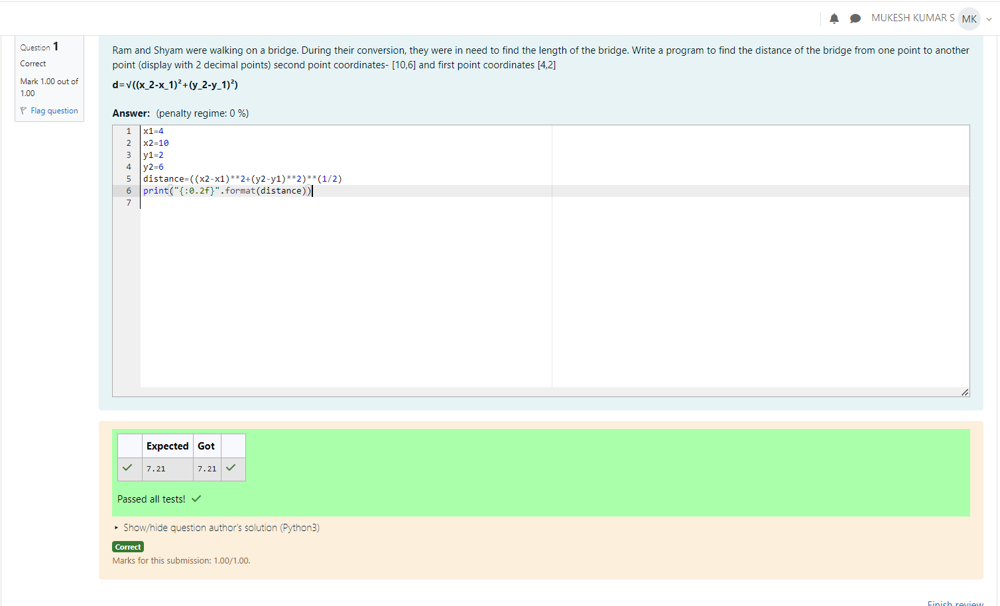

# DISTANCE-BETWEEN-TWO-POINTS

## AIM:
To write a python program to find the distance two 2 points
## ALGORITHM:
### Step 1: 
Get the first point (x1,y1)
### Step 2: 
get the second point (x2,y2)
### Step 3: 
Substitute the values in the distance formula  
### Step 4: 
print the calculated distance between those two points
### Step 5: 
end the program
### PROGRAM:
```
x1=4
x2=10
y1=2
y2=6
distance=((x2-x1)**2+(y2-y1)**2)**(1/2)
print("{:0.2f}".format(distance))
```


### OUTPUT:



### RESULT:
The code is executed sucessfully.
